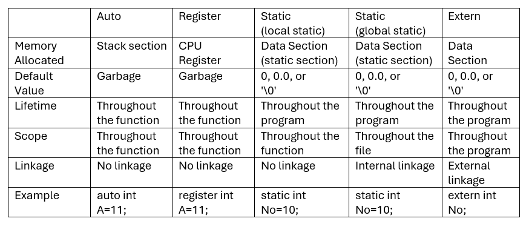
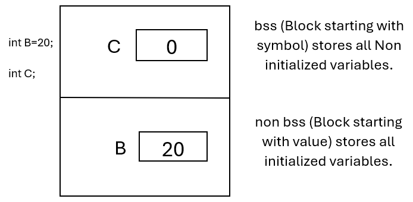

# STORAGE CLASSES

Concept of storage class is almost language independent. It is almost same in every programming language (C,C++, Java).
The concept of storage class completely depends upon the logic that we used to write the application.
There are 4 storage classes in C & C++.

---

## Index: Storage_Classes

| 🗂️ File Name        | 🔍 Description            |
| ------------------- | ------------------------- |
| `6.c`               | Storage Classes: Auto     |
| `7.c`               | Storage Classes: Register |
| `8.c`               | Storage Classes: Extern   |
| `9.c`               | Storage Classes: Extern   |
| `10.c`              | Storage Classes: Static   |
| `bss.png`           | bss & non bss image       |
| `Storage_class.png` | Storage Class table image |

---

## Every storage class is dependent upon the below points:

1. Where the memory gets allocated for the variable?
2. What is the default value of the variable?
3. What is the lifetime of the variable?
4. What is the linkage of the variable?
5. What is the scope of the variable?

## The four storage classes are:

1. Auto
2. Static
3. Register
4. Extern

---

## Concept of Storage class is same in all programming languages:

---

## • Auto Storage Class:

1. Every local variable is considered as a variable with auto storage class, that is; auto is the default storage class for every local variable.
2. When we create a variable having auto storage class, its memory gets allocated inside the stack section.
3. If the variable is not initialized with any of the value then it may contain garbage in it.
4. The scope and lifetime of the variable is only inside the function in which it gets created.
5. The linkage of the auto storage class is no linkage because it is not accessible outside the function or file or program.

## • Register Storage Class:

1. Register storage class is almost similar as the auto storage class.
2. In case of auto storage class, the memory for the variable gets allocated inside the stack segment which is the part of RAM.
3. To access any variable from the RAM it should be copied from RAM to CPU register.
4. If we use the register storage class the memory for the variable gets directly allocated inside the CPU registers.

• Limitations of the register storage class :

1. As there are limited number of CPU registers, the register storage class is considered as a request.
2. If the CPU register is available, then the operating system is allocated the register otherwise that variable is treated with auto storage class.
3. Register storage class is applicable for character and integer only.
4. We cannot create a global variable with register storage class.

## • Extern Storage Class:

1. Extern is a storage class which is applicable to the global variables used in the program.
2. If we apply extern storage class to the variable, then the value of that variable gets accessed from one file to another file.
3. If the variable is created globally then the default storage class of that variable is extern.
4. The extern keyword is used if we want to access the global variable from one file into another file.
5. All the global variables get the memory inside data section.
6. The Data section is divided into two parts:  
    -- a. bss (Block starting with symbol):  
    This section contains all about non initialized global variables.  
    -- b. non bss (Block starting with value):  
    It contains the initialized global variables.

   

### • Declaration VS. Definition:

-- Declaration:  
Declaration is considered as such a place in the program which just notifies about the name of variable, its data type. In case of declaration there is no memory allocation. If the variable is created with the ‘extern’ keyword then it is considered as the declaration  
Eg: extern int A;

Note: We can’t initialize the variable with extern keyword because there is no memory allocation.

-- Definition:  
Definition is a statement where the name of variable, its data type, its value gets identified and at that point the memory for the variable is also allocated.  
Eg: int No = 11; ---definition  
int x; ---definition

## • Static Storage Class:

1. The static storage class is used to preserve the value of a variable across the function calls.
2. When we call the function for the first time the value of the local static variable gets updated and when we call the function next time we get the previous updated value.
3. The concept of static is used in the topic named as Recursion. Calling the function from the same function itself is called as recursion.

## • Global Static Variable:

1. We can create the static variable either inside the function (local static) or outside the function (global static).
2. If the variable is created as global static variable than that variable is only accessible inside the file means we cannot access that global static variable outside the file using the extern keyword.
